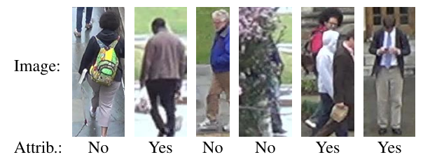
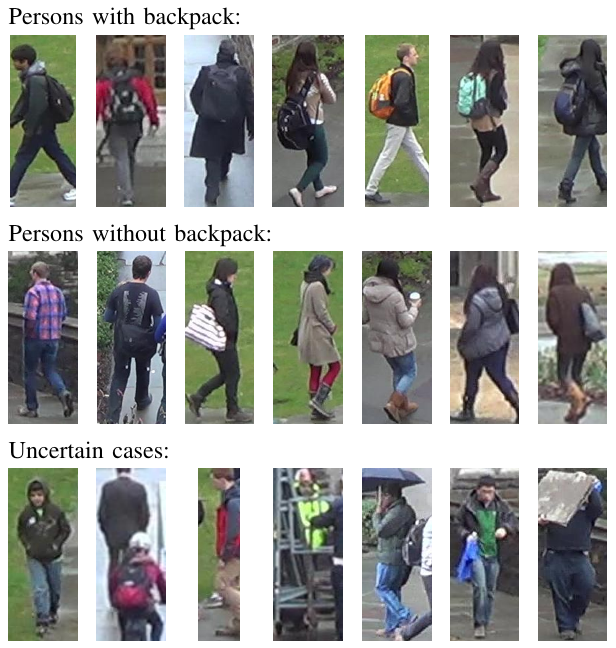

# DukeMTMC-backpack

## About dataset

DukeMTMC-backpack comprises altered annotations for the DukeMTMC-attribute dataset to fit only the backpack attribute, which is just one of the 24 original attributes.
In our preliminary experiments we realized that since the original attributes are assigned based on the entities (people), rather than visual assessment of the attribute in the individual images, a single-class binary classifier cannot be realized.

Using our custom software we manually re-annotated the images into three classes: with backpack, without backpack, and uncertain.   
We re-annotated each image separately. 
Our annotation tool was designed to show the images in random order, so the operator could classify samples based only on a single image of an entity, rather than from multiple images of the same entity.
We put the image to uncertain class either when there were more than one person in an image or when the backpack might not be observed. 
From the total of 34183 original annotations, 61.8\% were unchanged, 37.0\% were marked as uncertain, and 1.2\% were changed to the opposite category, the detailed numbers are:

*  7984 images stayed with original mark **no**
*  13154 images stayed with original mark **yes**
*  297 images were re-annotated from **no** to **yes**
*  100 images were re-annotated from **yes** to **no**
*  12648 images were marked as **uncertain**

## Examples

Example of images and corresponding original annotation for backpack attribute, which are not correct in single-attribute task. 
You can see wrong annotation, bad cropping, object occlusion, multiple occluded persons, and front view which can not be decided.

Example of images from re-annotated dataset divided into three sets according to our manual annotation.

## Citation

DukeMTMC Dataset [Bibtex](CITATION_DukeMTMC.txt)

DukeMTMC-reID Protocol, Baseline [Bibtex](CITATION_DukeMTMC-reID.txt)

DukeMTMC-attribute [Bibtex](CITATION_DukeMTMC-attribute.txt)

DukeMTMC-backpack [Bibtex](CITATION_DukeMTMC-backpack.txt)

## Dataset Licence

Please follow the [LICENSE_DukeMTMC-backpack](LICENSE_DukeMTMC-backpack.txt). You are free to share, create and adapt the DukeMTMC-reID dataset, in the manner specified in the license.

Please see also the [LICENSE_DukeMTMC-attribute](LICENSE_DukeMTMC-attribute.txt) and [LICENSE_DukeMTMC](LICENSE_DukeMTMC.txt). Note that the citation files and licence files for these datasets were downloaded from [DukeMTMC-attribute GitHub repository](https://github.com/vana77/DukeMTMC-attribute) (on 2019-08-21).  

